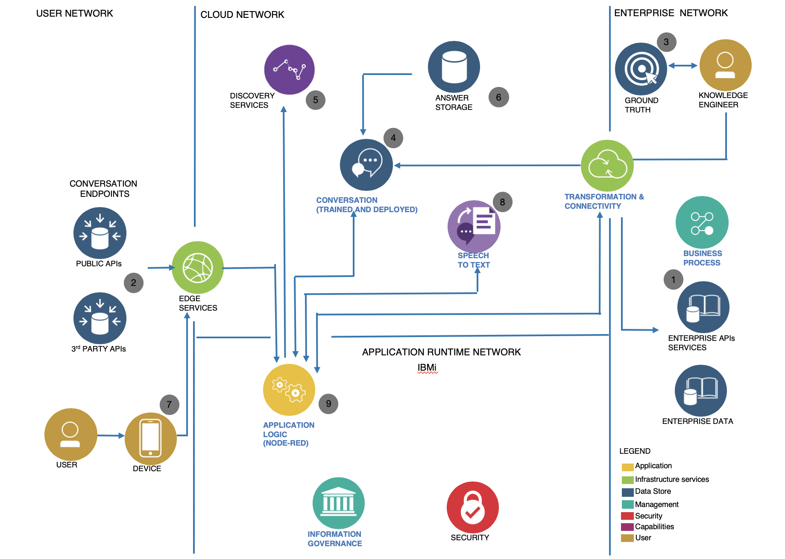

# Large User Group, Fall 2019

|**Consume Watson AI services on IBMi with Node-RED**

A short workshop to demonstrate how you might integrate a Watson Assistant skill with web-, mobile- or messenger-based user self-service IT support functions.

The chatbot application logic runs in the IBM i PASE environment, using native *node.js* and the [Node-RED](https://nodered.org) flow-based programming framework.

The chatbot exploits IBM i Services to query system information through the DB2 for i interface, as well as the PASE shell access to run native command-line functions.

Additional AI-based services - translation, tone analysis, speech<-->text conversion will be added to enhance the application.

# Overview

# ... to the workshop ...

[let's go!](ibmi-watson-helpdesk.md)

# and now for enhancements

The chatbot you've just built has a web interface, in English. 

## Multi-language support

To make the chatbot multi-lingual, all you'd need to do is translate input from the user's source language to English, and the chatbot response from English back to the user's language.
All you need is a [Watson Language Translator](https://www.ibm.com/watson/services/language-translator/) service instance, and a couple of Node-RED `language translator` nodes.

## FAQs

Want to give users access to documents, and frequently asked questions (FAQs) based on existing and dynamic content?
That's what the [Watson Discovery](https://www.ibm.com/cloud/watson-discovery/resources) service is for; create collections from document repositories, folders, and websites, and Discovery will enable natural language queries to retrieve documents and passages. 

If you enable the "Plus" trial on your Watson Assistant service, you can add in a Search skill; this will allow your chatbot to automatically initiate searches into your collections. 

## Emotional tone

Sometimes, users can get frustrated or agitated while engaged with a chatbot; in some cases, knowing when this is happening can be helpful in adjusting continuing interactions, including redirecting to helpdesk staff.  The [Watson Tone Analyzer](https://www.ibm.com/watson/services/tone-analyzer/) can help by detecting emotional mix in the way users express themselves, and providing indicators to the chatbot application. There's a Node-RED node for that! 

# other resources

check out other workshops and tutorials at [IBMDeveloperUK](https://github.com/IBMDeveloperUK)

